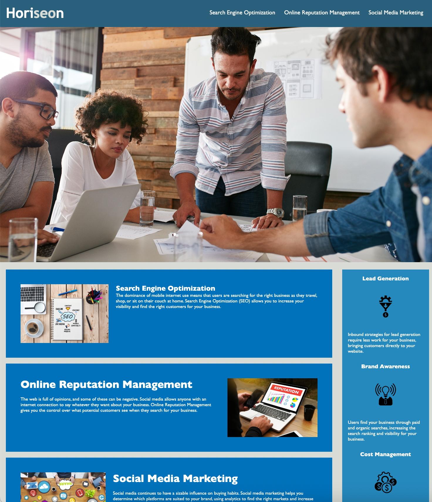

Challenge Title: 01 HTML, CSS, and Git: Code Refactor

WHY DID I BUILD THIS PROJECT & WHAT PROBLEM DOES IT SOLVE: To increase this website's web accessibility, which will ensures that people with disabilities can access a website using assistive technologies like video captions, screen readers, and braille keyboards. This process will also improve the site's SEO: it's rank in search engines like Google.

WHAT DID YOU LEARN: To be mindful when writing HTML and CSS to make sure that I'm including the proper descriptions and tags for proper accessibility. Also I learned to be mindful about the efficiency of one's code to avoid redundancies. 

Installation: This application can be accessed by following the below link

LINK TO DEPLOYED APPLICATION: https://nelson92.github.io/challenge-01-code/

Screenshot link:    
    

